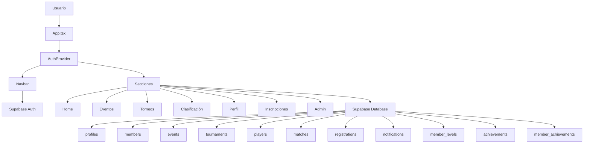
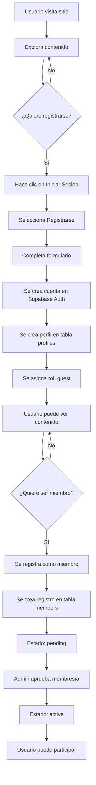
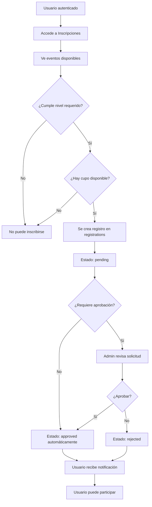

# Análisis Completo del Proyecto - Casa Latina Ping Pong Club

## 📋 Resumen Ejecutivo

**Nombre del Proyecto:** Casa Latina Ping Pong Club  
**Tipo:** Aplicación Web SPA (Single Page Application)  
**Ubicación:** San Cristóbal de las Casas, Chiapas, México  
**Stack Tecnológico:** React 18 + TypeScript + Vite + TailwindCSS + Supabase  

## 🎯 Propósito del Proyecto

Sistema de gestión integral para un club de ping pong que permite:
- Gestión de eventos y torneos
- Registro de miembros con sistema de niveles y experiencia (XP)
- Tabla de clasificación y estadísticas de jugadores
- Sistema de inscripciones a eventos y torneos
- Sistema de notificaciones
- Panel de administración para gestionar el club

---

## 🏗️ Arquitectura del Sistema

### Modelo de Navegación
- **SPA Pattern:** Aplicación de página única con navegación basada en estado
- **State Management:** `currentSection` en [`App.tsx`](src/App.tsx:18) controla qué sección se muestra
- **Auth Flow:** [`AuthProvider`](src/contexts/AuthContext.tsx:18) envuelve toda la aplicación y gestiona el estado de autenticación

### Diagrama de Arquitectura



---

## 🗂️ Estructura del Proyecto

### Directorios Principales

```
casalatina/
├── src/
│   ├── components/          # Componentes React
│   ├── contexts/           # Contextos de React
│   ├── lib/                # Utilidades y configuraciones
│   ├── types/              # Definiciones TypeScript
│   ├── App.tsx             # Componente principal
│   ├── main.tsx            # Punto de entrada
│   └── index.css           # Estilos globales
├── supabase/
│   └── migrations/         # Migraciones SQL
├── public/                 # Archivos estáticos
└── plans/                  # Documentación de planificación
```

---

## 📦 Componentes Principales

### 1. [`App.tsx`](src/App.tsx:1)
**Responsabilidad:** Router principal y layout de la aplicación

**Secciones gestionadas:**
- `home` - Página de inicio con Hero, ClubInfo, Location, EventsList
- `events` - Lista de eventos
- `leaderboard` - Tabla de clasificación
- `tournaments` - Torneos disponibles
- `auth` - Formulario de autenticación
- `register` - Registro de miembros
- `admin` - Panel de administración
- `profile` - Perfil de miembro
- `registrations` - Sistema de inscripciones

### 2. [`Navbar.tsx`](src/components/Navbar.tsx:1)
**Responsabilidad:** Navegación principal y menú responsive

**Características:**
- Menú responsive (desktop y móvil)
- Navegación condicional según rol del usuario
- Integración con [`NotificationCenter`](src/components/NotificationCenter.tsx:1)
- Logo del club

### 3. [`AdminDashboard.tsx`](src/components/AdminDashboard.tsx:1)
**Responsabilidad:** Panel de administración para admins y líderes

**Pestañas disponibles:**
- `events` - Gestión de eventos
- `tournaments` - Gestión de torneos
- `members` - Gestión de miembros
- `rankings` - Gestión de clasificaciones
- `registrations` - Aprobación de inscripciones
- `achievements` - Gestión de logros
- `club-info` - Información del club

**Roles con acceso:** `admin`, `leader`

### 4. [`EventsList.tsx`](src/components/EventsList.tsx:1)
**Responsabilidad:** Mostrar lista de eventos próximos

**Tipos de eventos:**
- `training` - Entreno y Retas
- `tournament` - Torneo
- `social` - Social
- `documentary` - Proyección
- `other` - Otro

### 5. [`RegistrationSystem.tsx`](src/components/RegistrationSystem.tsx:1)
**Responsabilidad:** Sistema de inscripciones a eventos y torneos

**Funcionalidades:**
- Registro a eventos (con límite de participantes)
- Registro a torneos
- Ver inscripciones propias
- Validación de nivel requerido

### 6. [`MemberProfile.tsx`](src/components/MemberProfile.tsx:1)
**Responsabilidad:** Perfil de miembro con estadísticas

**Información mostrada:**
- Nivel actual con barra de progreso XP
- Estadísticas de juego (partidos, ganados, perdidos, % victoria)
- Puntos de ranking
- Logros obtenidos

### 7. [`Leaderboard.tsx`](src/components/Leaderboard.tsx:1)
**Responsabilidad:** Tabla de clasificación de jugadores

**Datos mostrados:**
- Posición con medallas (🥇🥈🥉)
- Nombre del jugador
- Nivel
- Puntos de ranking
- Estadísticas de partidos

### 8. [`AuthContext.tsx`](src/contexts/AuthContext.tsx:1)
**Responsabilidad:** Gestión de autenticación y estado de usuario

**Funciones proporcionadas:**
- `signUp` - Registro de nuevos usuarios
- `signIn` - Inicio de sesión
- `signOut` - Cierre de sesión
- `loadProfile` - Carga del perfil del usuario

---

## 🗄️ Base de Datos (Supabase)

### Tablas Principales

#### 1. [`profiles`](supabase/migrations/000_init_schema.sql:9)
**Propósito:** Perfiles de usuario

**Campos:**
- `id` (uuid) - Referencia a auth.users
- `email` (text) - Email del usuario
- `full_name` (text) - Nombre completo
- `role` (text) - Rol legacy: admin/member/guest
- `extended_role` (text) - Rol extendido: admin/leader/member/guest
- `created_at` (timestamptz)

**Políticas RLS:**
- Público puede ver perfiles
- Usuarios pueden insertar su propio perfil
- Usuarios pueden actualizar su propio perfil

#### 2. [`members`](supabase/migrations/000_init_schema.sql:36)
**Propósito:** Información de membresía del club

**Campos:**
- `id` (uuid) - ID único
- `user_id` (uuid) - Referencia a profiles
- `phone` (text) - Teléfono
- `membership_status` (text) - active/inactive/pending
- `xp_total` (integer) - Total de experiencia
- `level_id` (uuid) - Nivel actual
- `joined_at` (timestamptz)
- `updated_at` (timestamptz)

**Políticas RLS:**
- Usuarios autenticados pueden ver miembros
- Usuarios pueden registrarse como miembros
- Usuarios pueden actualizar su propia membresía
- Admins pueden actualizar cualquier membresía

#### 3. [`events`](supabase/migrations/000_init_schema.sql:82)
**Propósito:** Eventos del club

**Campos:**
- `id` (uuid) - ID único
- `title` (text) - Título del evento
- `description` (text) - Descripción
- `event_date` (timestamptz) - Fecha del evento
- `event_type` (text) - Tipo: training/tournament/social/documentary/other
- `location` (text) - Ubicación
- `flyer_url` (text) - URL del flyer
- `min_level_id` (uuid) - Nivel mínimo requerido
- `max_participants` (integer) - Máximo de participantes
- `registration_enabled` (boolean) - Si el registro está habilitado
- `current_participants` (integer) - Participantes actuales
- `created_by` (uuid) - Creador del evento
- `created_at` (timestamptz)
- `updated_at` (timestamptz)

**Políticas RLS:**
- Público puede ver eventos
- Solo admins pueden crear eventos
- Solo admins pueden actualizar eventos
- Solo admins pueden eliminar eventos

#### 4. [`tournaments`](supabase/migrations/000_init_schema.sql:142)
**Propósito:** Torneos del club

**Campos:**
- `id` (uuid) - ID único
- `name` (text) - Nombre del torneo
- `description` (text) - Descripción
- `start_date` (timestamptz) - Fecha de inicio
- `end_date` (timestamptz) - Fecha de fin
- `status` (text) - Estado: upcoming/active/completed
- `max_participants` (integer) - Máximo de participantes
- `min_level_id` (uuid) - Nivel mínimo requerido
- `created_by` (uuid) - Creador del torneo
- `created_at` (timestamptz)

**Políticas RLS:**
- Público puede ver torneos
- Solo admins pueden crear torneos
- Solo admins pueden actualizar torneos
- Solo admins pueden eliminar torneos

#### 5. [`players`](supabase/migrations/000_init_schema.sql:202)
**Propósito:** Estadísticas de jugadores

**Campos:**
- `id` (uuid) - ID único
- `user_id` (uuid) - Referencia a profiles
- `ranking_points` (integer) - Puntos de ranking
- `matches_played` (integer) - Partidos jugados
- `matches_won` (integer) - Partidos ganados
- `matches_lost` (integer) - Partidos perdidos
- `win_rate` (decimal) - Porcentaje de victorias
- `updated_at` (timestamptz)

**Políticas RLS:**
- Público puede ver jugadores
- Usuarios autenticados pueden crear su perfil de jugador
- Solo admins pueden actualizar estadísticas de jugadores

#### 6. [`matches`](supabase/migrations/000_init_schema.sql:291)
**Propósito:** Registro de partidos

**Campos:**
- `id` (uuid) - ID único
- `tournament_id` (uuid) - Referencia a tournaments
- `player1_id` (uuid) - Jugador 1
- `player2_id` (uuid) - Jugador 2
- `player1_score` (integer) - Puntuación jugador 1
- `player2_score` (integer) - Puntuación jugador 2
- `winner_id` (uuid) - Ganador
- `match_date` (timestamptz) - Fecha del partido
- `status` (text) - Estado: scheduled/in_progress/completed
- `created_at` (timestamptz)

**Políticas RLS:**
- Público puede ver partidos
- Solo admins pueden crear partidos
- Solo admins pueden actualizar partidos

#### 7. [`tournament_participants`](supabase/migrations/000_init_schema.sql:244)
**Propósito:** Participantes en torneos

**Campos:**
- `id` (uuid) - ID único
- `tournament_id` (uuid) - Referencia a tournaments
- `player_id` (uuid) - Referencia a players
- `seed` (integer) - Semilla del torneo
- `status` (text) - Estado: registered/active/eliminated/winner
- `registered_at` (timestamptz)

**Políticas RLS:**
- Público puede ver participantes
- Jugadores pueden registrarse a torneos
- Admins pueden gestionar participantes

#### 8. [`member_levels`](supabase/migrations/003_create_levels_system.sql:9)
**Propósito:** Niveles de membresía

**Campos:**
- `id` (uuid) - ID único
- `name` (text) - Nombre del nivel
- `level_number` (integer) - Número de nivel
- `min_xp` (integer) - XP mínimo requerido
- `benefits` (jsonb) - Beneficios del nivel
- `color` (text) - Color para UI
- `created_at` (timestamptz)

**Políticas RLS:**
- Público puede ver niveles

#### 9. [`achievements`](supabase/migrations/003_create_levels_system.sql:29)
**Propósito:** Logros disponibles

**Campos:**
- `id` (uuid) - ID único
- `name` (text) - Nombre del logro
- `description` (text) - Descripción
- `xp_reward` (integer) - XP otorgado
- `icon` (text) - Icono
- `category` (text) - Categoría
- `created_at` (timestamptz)

**Políticas RLS:**
- Público puede ver logros

#### 10. [`member_achievements`](supabase/migrations/003_create_levels_system.sql:48)
**Propósito:** Logros obtenidos por miembros

**Campos:**
- `id` (uuid) - ID único
- `user_id` (uuid) - Referencia a profiles
- `achievement_id` (uuid) - Referencia a achievements
- `earned_at` (timestamptz) - Fecha de obtención

**Políticas RLS:**
- Público puede ver logros de miembros

#### 11. [`registrations`](supabase/migrations/004_create_registrations.sql:8)
**Propósito:** Inscripciones a eventos y torneos

**Campos:**
- `id` (uuid) - ID único
- `user_id` (uuid) - Referencia a profiles
- `target_type` (text) - Tipo: event/tournament
- `target_id` (uuid) - ID del objetivo
- `status` (text) - Estado: pending/approved/rejected/cancelled
- `registered_at` (timestamptz)
- `reviewed_at` (timestamptz)
- `reviewed_by` (uuid) - Quién revisó
- `notes` (text) - Notas

**Políticas RLS:**
- Público puede ver inscripciones
- Usuarios pueden crear sus inscripciones
- Admins y líderes pueden gestionar inscripciones

#### 12. [`notifications`](supabase/migrations/005_create_notifications.sql:8)
**Propósito:** Notificaciones para usuarios

**Campos:**
- `id` (uuid) - ID único
- `user_id` (uuid) - Referencia a profiles
- `type` (text) - Tipo: registration_approved/registration_rejected/achievement_earned/level_up/event_reminder
- `title` (text) - Título
- `message` (text) - Mensaje
- `related_id` (uuid) - ID relacionado
- `is_read` (boolean) - Si está leída
- `created_at` (timestamptz)

**Políticas RLS:**
- Público puede ver notificaciones
- Usuarios pueden marcar como leídas
- Admins pueden ver todas las notificaciones

---

## 🔐 Sistema de Roles y Permisos

### Roles Disponibles

1. **`guest`** (Invitado)
   - Puede ver eventos, torneos y clasificaciones
   - Puede crear cuenta
   - No puede registrarse como miembro

2. **`member`** (Miembro)
   - Todas las funciones de guest
   - Puede registrarse como miembro del club
   - Puede participar en torneos
   - Puede ver su perfil y estadísticas
   - Puede inscribirse a eventos y torneos

3. **`leader`** (Líder)
   - Todas las funciones de member
   - Puede acceder al panel de administración
   - Puede gestionar inscripciones (aprobar/rechazar)
   - Puede ver y gestionar miembros

4. **`admin`** (Administrador)
   - Todas las funciones de leader
   - Control total del club
   - Puede crear, editar y eliminar eventos
   - Puede crear y gestionar torneos
   - Puede gestionar todos los aspectos del club

### Permisos por Rol

| Funcionalidad | Guest | Member | Leader | Admin |
|--------------|-------|--------|--------|-------|
| Ver eventos | ✅ | ✅ | ✅ | ✅ |
| Ver torneos | ✅ | ✅ | ✅ | ✅ |
| Ver clasificación | ✅ | ✅ | ✅ | ✅ |
| Crear cuenta | ✅ | ✅ | ✅ | ✅ |
| Registrarse como miembro | ❌ | ✅ | ✅ | ✅ |
| Ver perfil | ❌ | ✅ | ✅ | ✅ |
| Inscribirse a eventos | ❌ | ✅ | ✅ | ✅ |
| Inscribirse a torneos | ❌ | ✅ | ✅ | ✅ |
| Acceder a panel admin | ❌ | ❌ | ✅ | ✅ |
| Crear eventos | ❌ | ❌ | ❌ | ✅ |
| Editar eventos | ❌ | ❌ | ❌ | ✅ |
| Eliminar eventos | ❌ | ❌ | ❌ | ✅ |
| Crear torneos | ❌ | ❌ | ❌ | ✅ |
| Gestionar miembros | ❌ | ❌ | ✅ | ✅ |
| Aprobar inscripciones | ❌ | ❌ | ✅ | ✅ |
| Gestionar logros | ❌ | ❌ | ❌ | ✅ |

---

## 🎨 Sistema de Diseño

### Paleta de Colores (Chiapas-inspired)

Definida en [`tailwind.config.js`](tailwind.config.js:7):

```javascript
colors: {
  chiapas: {
    blue: '#1B5E9F',        // Azul principal
    'blue-dark': '#164A7E', // Azul oscuro
    'blue-light': '#2E7BBF', // Azul claro
    jade: '#10B981',        // Jade (verde)
    teal: '#14B8A6',        // Turquesa
    orange: '#F97316',      // Naranja
    red: '#EF4444',         // Rojo
    yellow: '#EAB308',      // Amarillo
  }
}
```

### Animaciones Personalizadas

Definidas en [`src/index.css`](src/index.css:1):
- `ping-pong-bounce` - Animación de rebote
- `float` - Animación flotante
- `paddle-swing` - Animación de paleta
- Otras animaciones personalizadas

### Imágenes del Proyecto

**Header:**
- [`header.png`](public/header.png) - Imagen de fondo del header

**Footer:**
- [`footer.png`](public/footer.png) - Imagen de fondo del footer

**Secciones:**
- [`clasificacion.png`](public/clasificacion.png) - Fondo de clasificación
- [`eventos.png`](public/eventos.png) - Fondo de eventos
- [`torneo.png`](public/torneo.png) - Fondo de torneos
- [`comunidad.png`](public/comunidad.png) - Fondo de comunidad
- [`musica.png`](public/musica.png) - Fondo de música
- [`arte.png`](public/arte.png) - Fondo de arte

**Logo:**
- [`Captura_de_pantalla_2026-02-13_a_la(s)_11.00.56_a.m..png`](public/Captura_de_pantalla_2026-02-13_a_la(s)_11.00.56_a.m..png) - Logo del club

---

## 🔗 Flujo de Usuario

### Diagrama de Flujo de Registro



### Diagrama de Flujo de Inscripción a Eventos



---

## 📊 Tipos TypeScript

Definidos en [`src/types/index.ts`](src/types/index.ts:1):

### Interfaces Principales

1. **[`Profile`](src/types/index.ts:1)** - Perfil de usuario
2. **[`Member`](src/types/index.ts:10)** - Miembro del club
3. **[`Event`](src/types/index.ts:23)** - Evento
4. **[`Tournament`](src/types/index.ts:41)** - Torneo
5. **[`Player`](src/types/index.ts:55)** - Jugador con estadísticas
6. **[`Match`](src/types/index.ts:74)** - Partido
7. **[`TournamentParticipant`](src/types/index.ts:87)** - Participante en torneo
8. **[`ClubInfo`](src/types/index.ts:98)** - Información del club
9. **[`MemberLevel`](src/types/index.ts:105)** - Nivel de miembro
10. **[`Achievement`](src/types/index.ts:115)** - Logro
11. **[`MemberAchievement`](src/types/index.ts:125)** - Logro obtenido
12. **[`Registration`](src/types/index.ts:134)** - Inscripción
13. **[`Notification`](src/types/index.ts:147)** - Notificación

---

## 🚀 Scripts de Desarrollo

Definidos en [`package.json`](package.json:6):

```json
{
  "dev": "vite",                    // Servidor de desarrollo
  "build": "vite build",            // Build para producción
  "lint": "eslint .",               // Ejecutar ESLint
  "preview": "vite preview",        // Previsualizar build
  "typecheck": "tsc --noEmit -p tsconfig.app.json"  // Type checking
}
```

---

## 🔧 Configuración del Entorno

### Variables de Entorno Requeridas

Definidas en [`.env.local`](.env.local) (no versionado):

```bash
VITE_SUPABASE_URL=<url-del-proyecto-supabase>
VITE_SUPABASE_ANON_KEY=<clave-anonima-del-proyecto-supabase>
```

### Configuración de Supabase

El cliente de Supabase se configura en [`src/lib/supabase.ts`](src/lib/supabase.ts:1):

```typescript
import { createClient } from '@supabase/supabase-js';

const supabaseUrl = import.meta.env.VITE_SUPABASE_URL;
const supabaseAnonKey = import.meta.env.VITE_SUPABASE_ANON_KEY;

export const supabase = createClient(supabaseUrl, supabaseAnonKey);
```

---

## 📝 Documentación Disponible

1. **[`README.md`](README.md:1)** - Resumen del proyecto
2. **[`CLAUDE.md`](CLAUDE.md:1)** - Guía para Claude Code
3. **[`SETUP_ADMIN.md`](SETUP_ADMIN.md:1)** - Configuración de administrador
4. **[`SUPABASE_DEPLOYMENT.md`](SUPABASE_DEPLOYMENT.md:1)** - Guía de deployment en Supabase

---

## 🔍 Estado Actual del Proyecto

### Funcionalidades Implementadas

✅ Sistema de autenticación con Supabase  
✅ Sistema de roles (guest, member, leader, admin)  
✅ Gestión de eventos  
✅ Gestión de torneos  
✅ Tabla de clasificación  
✅ Perfil de miembro con estadísticas  
✅ Sistema de niveles y XP  
✅ Sistema de logros  
✅ Sistema de inscripciones  
✅ Sistema de notificaciones  
✅ Panel de administración  
✅ Navegación responsive  
✅ Diseño con TailwindCSS y colores de Chiapas  

### Posibles Mejoras Futuras

🔲 Sistema de chat entre miembros  
🔲 Galería de fotos de eventos  
🔲 Sistema de pagos para membresías  
🔲 Integración con redes sociales  
🔲 Sistema de ranking por categorías  
🔲 Estadísticas avanzadas y gráficos  
🔲 Sistema de recomendaciones de entrenamiento  
🔲 Calendario interactivo  
🔲 Sistema de encuestas y feedback  
🔲 Integración con Google Maps para ubicaciones  

---

## 🎯 Conclusiones

El proyecto **Casa Latina Ping Pong Club** es una aplicación web completa y bien estructurada para la gestión de un club de ping pong. Cuenta con:

- **Arquitectura sólida:** SPA con React y TypeScript
- **Backend robusto:** Supabase con autenticación y base de datos PostgreSQL
- **Sistema de roles completo:** 4 niveles de permisos bien definidos
- **UI/UX atractiva:** Diseño responsive con colores inspirados en Chiapas
- **Funcionalidades completas:** Gestión de eventos, torneos, miembros, estadísticas
- **Sistema de gamificación:** Niveles, XP y logros
- **Documentación exhaustiva:** Guías de configuración y deployment

El proyecto está listo para ser usado y puede ser extendido con nuevas funcionalidades según las necesidades del club.
